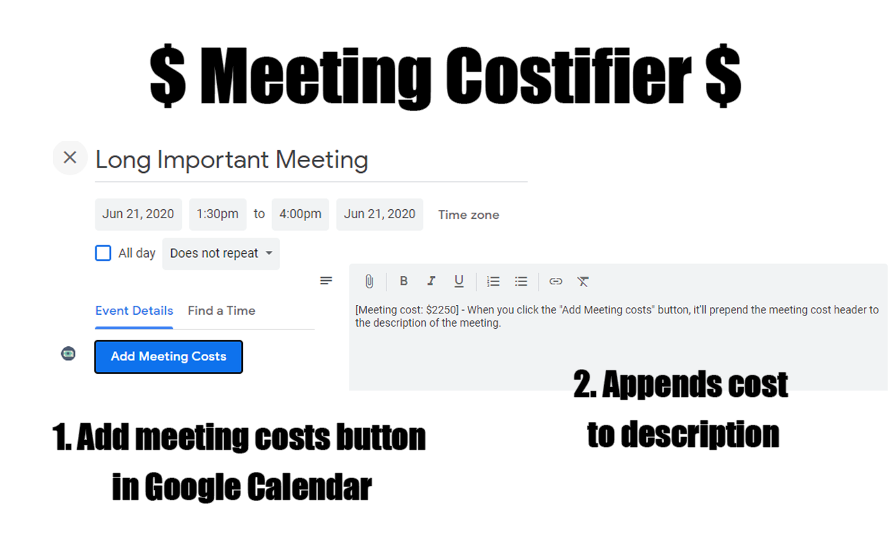

## Meeting Costifier

Quickly add a cost tag to your Google meeting signifying the value of meeting time. Encourage productive meetings and sanctify time.

## Download

You can download this extension in the Google Chrome store: https://chrome.google.com/webstore/detail/meeting-costifier

## Parameters

Currently, this extension uses the following parameters:
- Duration of the meeting (start/end date parsed from the DOM)
- Number of participants (parsed from the children divs in participants list or the guest count if available)
- $100 an hour

The cost calculation is currently #people * hours * $100.

## Screenshots

